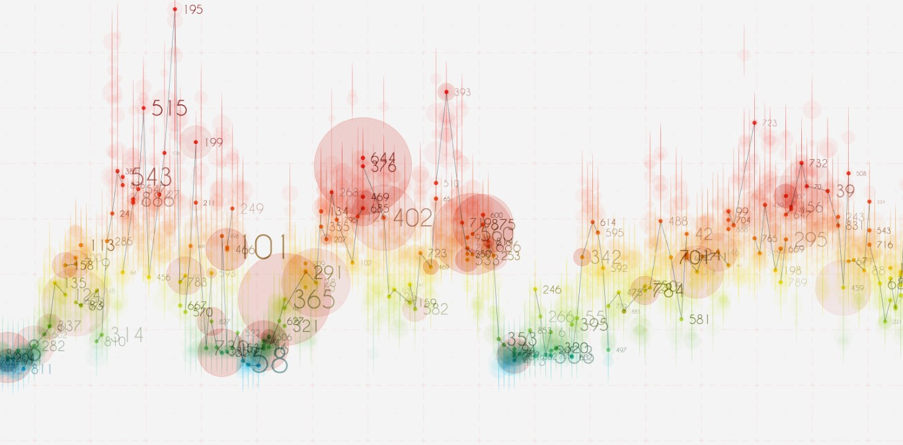

### Hi there 🙋🏻‍♂️, Ahoora Rostamian here,
#### Excited about anything data science and machine learning
---

I'm a PhD student in completion, studying computational finance at the University of Essex UK, doing research on the applications of deep learning models to design autonomous trading agents.

- 🖥️ I’m currently working on a project which utilises **computer vision** techniques in **financial forecasting** and **decision making**. 
- ✏️ I’m currently learning Reinforcement Learning, 📱Mobile App Development 

<h4 align="left">Languages and Tools:</h4>

                  

  
